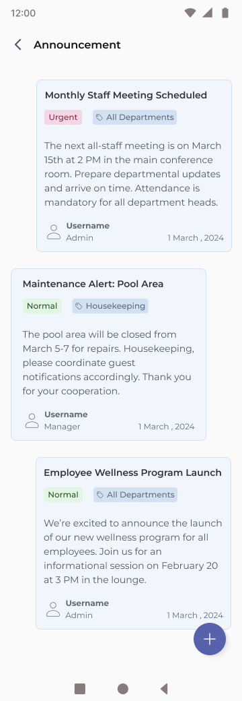
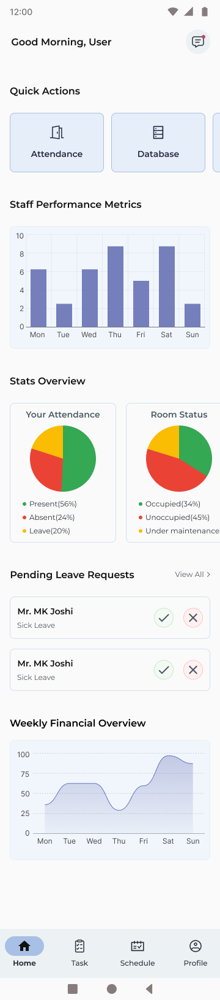
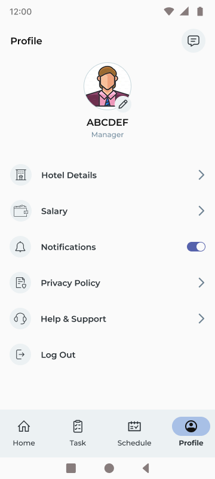
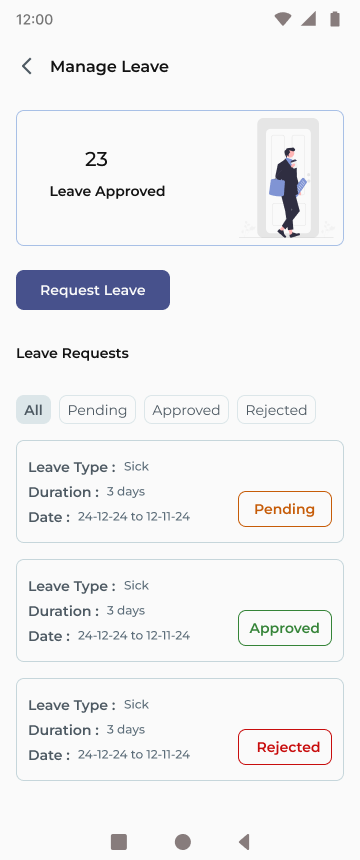
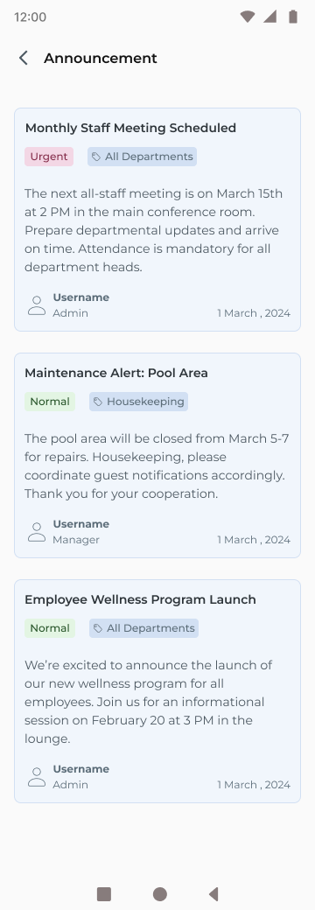
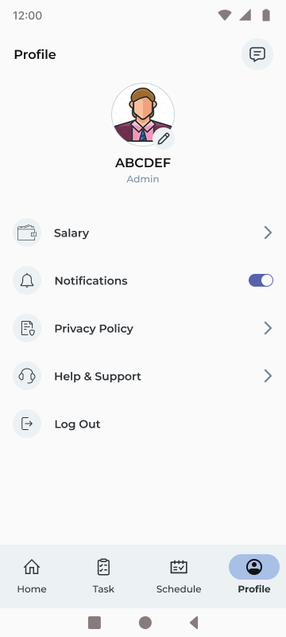
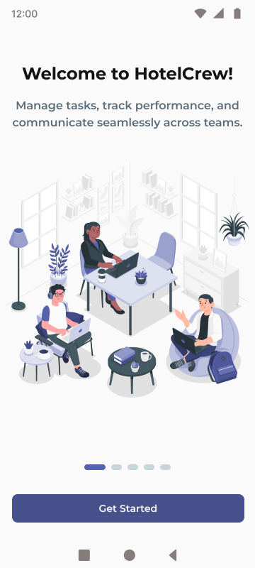
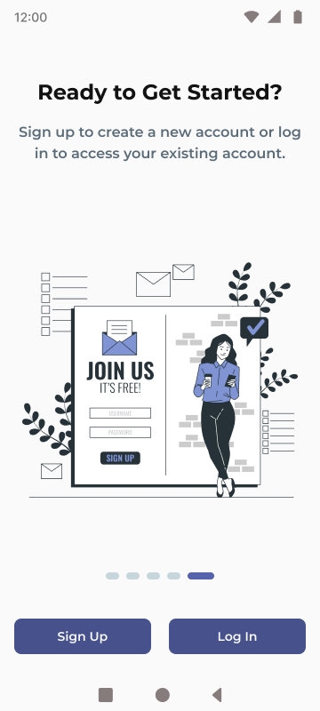
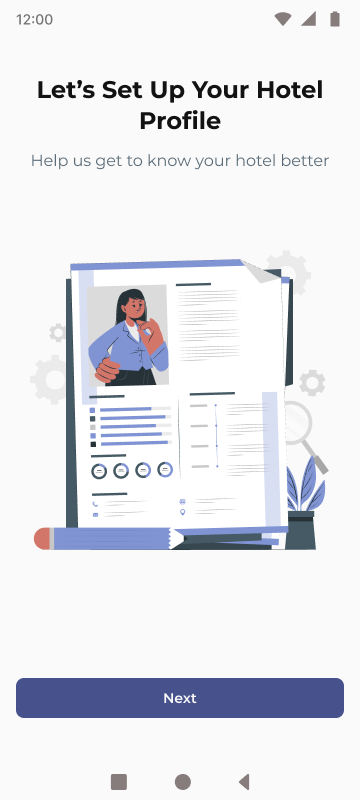
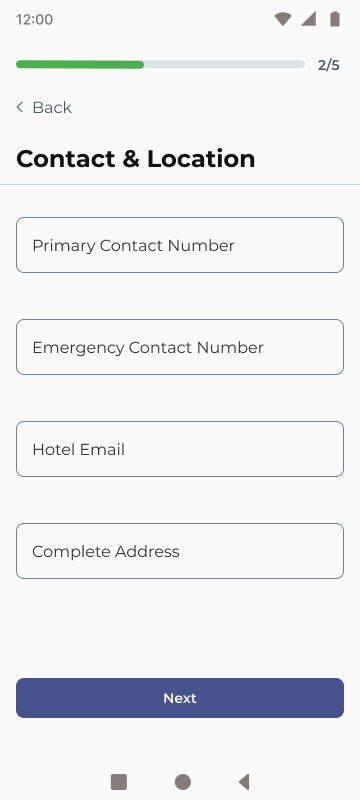

# Hotelcrew

Hotelcrew is an all-in-one hotel staff management application designed to simplify hotel operations. From hotel registration to staff management and analytics, the app provides powerful tools for admins, managers, receptionists, and staff to handle their tasks efficiently.

---
## Screenshots and Videos

### Admin Features
- **Hotel Registration**:
<div style="display: flex; gap: 10px; align-items: center;">
  
  
  
  
</div>

<div style="display: flex; gap: 10px; align-items: center; margin-top:10px">
  
  
  
  
</div>


### Manager Features
<div style="display: flex; gap: 10px; align-items: center;">
  
  
  
  
  
</div>

### Receptionist Features
<div style="display: flex; gap: 10px; align-items: center;">
  
  
  

</div>

### Staff Features
<div style="display: flex; gap: 10px; align-items: center;">
  
  
  
  
  
   
  
</div>


### Authentication
<div style="display: flex; gap: 10px; align-items: center;">
  
  
  
  
  
   
  


  

</div>
## Features

### Admin
- **Hotel Management**:
  - Register hotels.
  - View and update hotel details.
  - Analyze hotel performance through financial and operational metrics.
- **Staff Management**:
  - Import staff details via an Excel file (name, email, role, department, salary, shift, UPI ID).
  - Add, edit, or delete staff.
  - Track staff attendance and performance analytics.
  - Assign, edit, and delete tasks for staff.
  - Approve or reject leave applications.
  - Manage payroll for staff directly within the app.
- **Announcements**:
  - Create announcements for specific departments.
- **Dashboards**:
  - Bar chart graphs (powered by **fl_chart**) for:
    - Staff present, vacant, or busy.
    - Room availability (occupied vs. empty).
  - Shift management for staff.

### Receptionist
- **Task Management**:
  - Assign tasks to staff.
  - View tasks and announcements.
- **Attendance and Analytics**:
  - View attendance records by week or month.
  - Graphs for room occupancy.
- **Shift and Profile Management**:
  - View and update shifts.
  - Apply for leave.
  - Update profile picture and personal details.

### Staff
- **Task Tracking**:
  - Update task status: pending, in progress, or completed.
- **Attendance and Performance**:
  - View attendance records and performance metrics.
- **Leave Management**:
  - Track leave requests (pending or approved).
- **Profile Management**:
  - Update profile picture and personal details.

### Manager
- All admin functionalities except hotel registration.
- Can approve or reject leave applications.

---

## Tech Stack

| **Technology**         | **Purpose**                |
|-------------------------|----------------------------|
| **Flutter**             | Frontend Development       |
| **Django**              | Backend Development        |
| **Riverpod / Provider** | State Management           |
| **Dio / HTTP**          | API Communication          |
| **Firebase Messaging**  | Push Notifications         |
| **Flutter Diagnostic Tools** | Debugging and Performance |
| **GitHub Actions**      | CI/CD and Signed APK Creation |
| **fl_chart**            | Graph Visualizations       |

---

## Backend Details

The backend for Hotelcrew is built using **Django**, providing a robust and scalable solution for handling hotel and staff data.  
Backend Developer: **Mrigank Raj**  
GitHub Repository: [Mrigank Raj's Backend](https://github.com/mrigank-raj-backend-link)

---

## App Flow

### Hotel Registration
1. Admin registers the hotel.
2. Staff details are uploaded via an Excel file with fields:
   - Email, Name, Role, Department, Salary, Shift, UPI ID.

### Staff Management
- Staff details can be added, edited, or deleted by the admin.
- Admin can view and analyze staff performance, attendance, and shifts.

### Task and Announcement Management
- Tasks can be assigned by admins or receptionists.
- Announcements can be targeted to specific departments.

### Analytics and Dashboards
- Graphs for room occupancy, staff attendance, and hotel analytics.
- Admin and receptionist can track performance metrics.

---


---

## Installation

### Prerequisites
- Flutter 3.x or later
- Django backend setup
- Firebase configuration files
- Android Studio / VS Code

### Steps
1. **Clone the Frontend Repository**:
   ```bash
   git clone https://github.com/your-repo/hotelcrew.git
   cd hotelcrew
